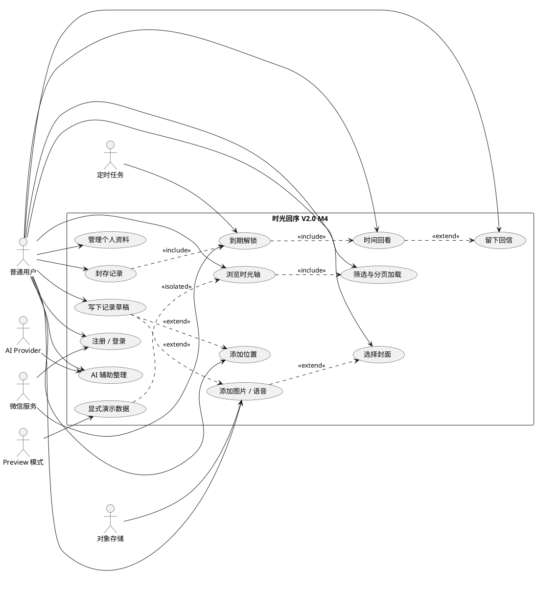
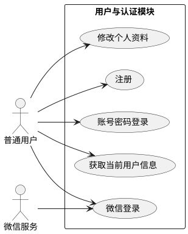
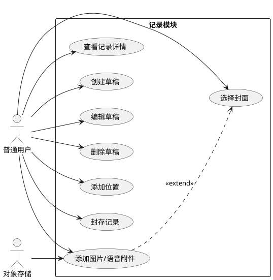
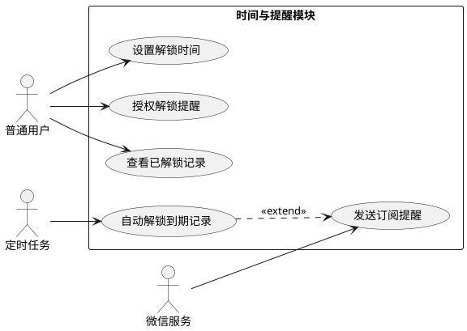
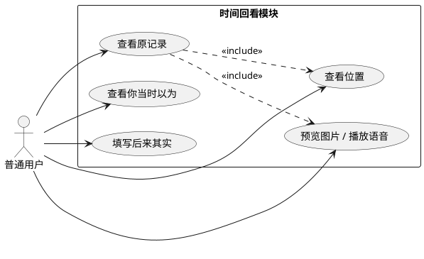
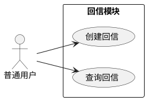
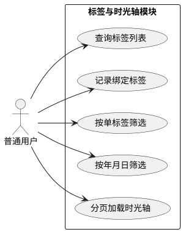
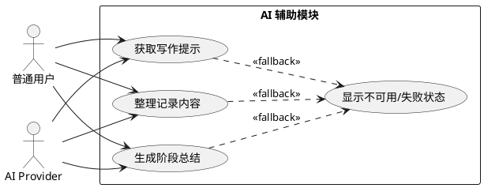
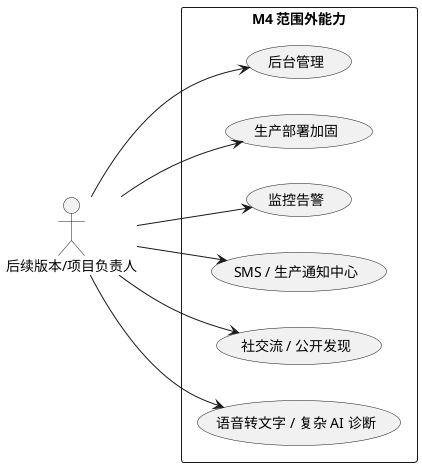

# 时光回序 UML 用例图源码包（V2.0 M4）

这份文档提供按当前 M4 状态整理后的 PlantUML 用例图源码。M4 聚焦微信小程序用户侧核心能力，不包含后台管理、生产部署、短信、生产通知中心、社交流或复杂 AI 诊断。

## 本地导出方式

```powershell
java -jar plantuml.jar *.puml -tpng
```
## 1. 项目总体用例图

保存为：`01_项目总体用例图.puml`



## 2. 用户模块用例图

保存为：`02_用户模块用例图.puml`



## 3. 记录模块用例图

保存为：`03_记录模块用例图.puml`



## 4. 时间与提醒模块用例图

保存为：`04_时间模块用例图.puml`



## 5. 回看模块用例图

保存为：`05_回看模块用例图.puml`



## 6. 回信模块用例图

保存为：`06_回信模块用例图.puml`



## 7. 标签与时光轴模块用例图

保存为：`07_标签模块用例图.puml`



## 8. AI 辅助模块用例图

保存为：`08_AI辅助模块用例图.puml`



## 9. M4 范围外说明图

保存为：`09_后台管理模块用例图.puml`



## 文件夹结构

```text
UML用例图/
├─ 01_项目总体用例图.puml
├─ 02_用户模块用例图.puml
├─ 03_记录模块用例图.puml
├─ 04_时间模块用例图.puml
├─ 05_回看模块用例图.puml
├─ 06_回信模块用例图.puml
├─ 07_标签模块用例图.puml
├─ 08_AI辅助模块用例图.puml
└─ 09_后台管理模块用例图.puml
```
