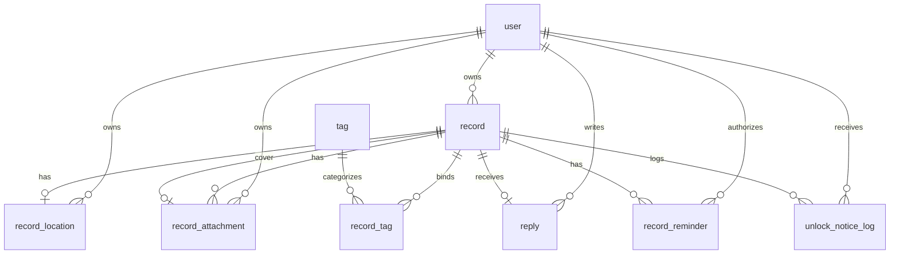

# 《时光回序》数据库设计文档（V2.0 M4）

## 1. 设计目标

数据库设计服务于微信小程序用户侧核心闭环：

- 支持账号密码登录与微信登录身份落库。
- 支持记录从草稿、封存到解锁的生命周期。
- 支持记录标签、时光轴筛选和稳定分页。
- 支持记录位置、图片/语音附件、封面和私有对象存储元数据。
- 支持已解锁记录的“后来其实”和可选回信。
- 支持解锁提醒授权与解锁通知日志。

M4 不包含后台管理表、生产通知中心、SMS、社交流、语音转文字或复杂 AI 诊断数据表。

## 2. 数据库环境约定

| 项 | 约定 |
| --- | --- |
| 数据库 | MySQL 8.x |
| 字符集 | `utf8mb4` |
| 排序规则 | `utf8mb4_unicode_ci` |
| 存储引擎 | InnoDB |
| 时间字段 | `DATETIME`，业务时区按后端 `app.time.zone-id=Asia/Shanghai` 处理 |
| 主键 | `BIGINT AUTO_INCREMENT` |
| 命名 | 表名、字段名使用小写下划线 |

## 3. 表设计总览

| 表名 | 说明 | M4 状态 |
| --- | --- | --- |
| `user` | 用户账号与微信 OpenID | 核心表 |
| `record` | 记录主体、生命周期、AI 辅助字段、封面引用 | 核心表 |
| `record_location` | 记录位置，独立子资源 | M4 新增核心表 |
| `record_attachment` | 图片/语音附件元数据与对象存储引用 | M4 新增核心表 |
| `tag` | 系统标签 | 核心表 |
| `record_tag` | 记录与标签多对多关联 | 核心表 |
| `reply` | 解锁后用户回信，单记录最多一条 | 核心表 |
| `record_reminder` | 解锁提醒授权与发送状态 | M3/M4 继承表 |
| `unlock_notice_log` | 解锁事件/通知日志 | 核心表 |

## 4. ER 图

## 5. 枚举值约定

| 字段 | 值 |
| --- | --- |
| `user.status` | `ENABLED`, `DISABLED` |
| `record.status` | `DRAFT`, `SEALED`, `UNLOCKED` |
| `record.record_type` | `FUTURE_LETTER`, `NODE_RECORD`, `EMOTION_NOTE` |
| `record.life_node_type` | `GRADUATION`, `WORK`, `MOVE`, `RELATIONSHIP`, `HEALTH`, `FAMILY`, `TURNING_POINT`, `OTHER` |
| `record_location.source` | `CURRENT_LOCATION`, `MAP_PICKER`, `MANUAL` |
| `record_attachment.type` | `IMAGE`, `VOICE` |
| `record_attachment.storage_provider` | `QINIU`, `S3_COMPATIBLE` |
| `record_attachment.status` | `AVAILABLE`, `DELETED` |
| `tag.type` | `SYSTEM`, `USER` |
| `tag.status` | `ENABLED`, `DISABLED` |
| `reply.reply_type` | `SHORT_REPLY` |
| `record_reminder.reminder_status` | `REQUESTED`, `SEND_SUCCESS`, `SEND_FAILED`, `DENIED`, `NOT_CONFIGURED` 等后端枚举值 |
| `unlock_notice_log.notice_type` | `SYSTEM_UNLOCK` |
| `unlock_notice_log.notice_status` | `SUCCESS`, `FAILED` |

## 6. 详细表结构

### 6.1 `user`

| 字段 | 类型 | 约束 | 说明 |
| --- | --- | --- | --- |
| `id` | BIGINT | PK | 用户 ID |
| `username` | VARCHAR(50) | NOT NULL, UNIQUE | 账号密码登录用户名 |
| `password_hash` | VARCHAR(255) | NOT NULL | 密码哈希 |
| `nickname` | VARCHAR(50) | NOT NULL | 昵称 |
| `email` | VARCHAR(100) | NULL | 邮箱 |
| `avatar` | VARCHAR(255) | NULL | 头像 |
| `openid` | VARCHAR(100) | UNIQUE, NULL | 微信 OpenID |
| `status` | VARCHAR(20) | NOT NULL, DEFAULT `ENABLED` | 用户状态 |
| `created_at` | DATETIME | NOT NULL | 创建时间 |
| `updated_at` | DATETIME | NOT NULL | 更新时间 |

索引：

- `uk_user_username(username)`
- `uk_user_openid(openid)`

### 6.2 `record`

| 字段 | 类型 | 约束 | 说明 |
| --- | --- | --- | --- |
| `id` | BIGINT | PK | 记录 ID |
| `user_id` | BIGINT | FK -> `user.id` | 所属用户 |
| `title` | VARCHAR(100) | NULL | 标题 |
| `content` | TEXT | NOT NULL | 原始记录正文 |
| `record_type` | VARCHAR(30) | NOT NULL | 记录类型 |
| `core_question` | VARCHAR(255) | NULL | 核心问题 |
| `status` | VARCHAR(20) | NOT NULL | `DRAFT` / `SEALED` / `UNLOCKED` |
| `unlock_at` | DATETIME | NULL | 计划解锁时间 |
| `sealed_at` | DATETIME | NULL | 封存时间 |
| `unlocked_at` | DATETIME | NULL | 实际解锁时间 |
| `ai_summary` | TEXT | NULL | AI 内容整理结果 |
| `ai_prompt_result` | TEXT | NULL | AI 提示结果 JSON 文本 |
| `belief_then` | TEXT | NULL | 你当时以为 |
| `reality_later` | TEXT | NULL | 后来其实 |
| `reality_later_submit_count` | INT | NOT NULL | later reflection 提交次数 |
| `life_node_type` | VARCHAR(30) | NULL | 人生节点类型 |
| `life_node_custom_label` | VARCHAR(50) | NULL | `OTHER` 自定义标签 |
| `cover_attachment_id` | BIGINT | NULL | 封面附件 ID，必须来自同记录 IMAGE 附件 |
| `created_at` | DATETIME | NOT NULL | 创建时间 |
| `updated_at` | DATETIME | NOT NULL | 更新时间 |

索引：

- `idx_record_user_id(user_id)`
- `idx_record_user_created_id(user_id, created_at, id)`：时光轴稳定分页
- `idx_record_status(status)`
- `idx_record_unlock_at(unlock_at)`
- `idx_record_user_status_created(user_id, status, created_at)`
- `idx_record_status_unlock_at(status, unlock_at)`：定时解锁扫描
- `idx_record_cover_attachment_id(cover_attachment_id)`

业务规则：

- `DRAFT` 可编辑正文、标签、位置、附件、封面。
- `SEALED` 和 `UNLOCKED` 不允许修改正文、位置、附件、封面。
- `cover_attachment_id` 必须由业务层校验为同记录、同用户、`IMAGE`、`AVAILABLE` 附件。

### 6.3 `record_location`

| 字段 | 类型 | 约束 | 说明 |
| --- | --- | --- | --- |
| `id` | BIGINT | PK | 位置 ID |
| `record_id` | BIGINT | UNIQUE, FK -> `record.id` | 所属记录 |
| `user_id` | BIGINT | FK -> `user.id` | 所属用户 |
| `source` | VARCHAR(30) | NOT NULL | `CURRENT_LOCATION` / `MAP_PICKER` / `MANUAL` |
| `name` | VARCHAR(100) | NULL | 地点名称 |
| `address` | VARCHAR(255) | NULL | 地址 |
| `latitude` | DECIMAL(10,7) | NULL | 纬度 |
| `longitude` | DECIMAL(10,7) | NULL | 经度 |
| `created_at` | DATETIME | NOT NULL | 创建时间 |
| `updated_at` | DATETIME | NOT NULL | 更新时间 |

索引：

- `uk_record_location_record(record_id)`：每条记录最多一个位置
- `idx_record_location_user_id(user_id)`

业务规则：

- `CURRENT_LOCATION` 和 `MAP_PICKER` 必须有经纬度。
- `MANUAL` 至少提供 `name` 或 `address`，经纬度可为空。
- 后端不做地理编码/逆地理编码。
- 仅草稿可新增、更新、删除。

### 6.4 `record_attachment`

| 字段 | 类型 | 约束 | 说明 |
| --- | --- | --- | --- |
| `id` | BIGINT | PK | 附件 ID |
| `record_id` | BIGINT | FK -> `record.id` | 所属记录 |
| `user_id` | BIGINT | FK -> `user.id` | 所属用户 |
| `type` | VARCHAR(20) | NOT NULL | `IMAGE` 或 `VOICE` |
| `storage_provider` | VARCHAR(20) | NOT NULL | `QINIU` 或 `S3_COMPATIBLE` |
| `bucket` | VARCHAR(100) | NOT NULL | 存储桶 |
| `storage_key` | VARCHAR(512) | NOT NULL | 对象 key |
| `file_name` | VARCHAR(255) | NOT NULL | 原始文件名 |
| `mime_type` | VARCHAR(100) | NOT NULL | MIME 类型 |
| `size_bytes` | BIGINT | NOT NULL | 文件大小 |
| `duration_seconds` | INT | NULL | 语音时长 |
| `width` | INT | NULL | 图片宽度 |
| `height` | INT | NULL | 图片高度 |
| `sort_order` | INT | NOT NULL | 排序 |
| `status` | VARCHAR(20) | NOT NULL | `AVAILABLE` / `DELETED` |
| `created_at` | DATETIME | NOT NULL | 创建时间 |
| `updated_at` | DATETIME | NOT NULL | 更新时间 |

索引：

- `uk_record_attachment_storage_key(storage_provider, bucket, storage_key)`
- `idx_record_attachment_record_status(record_id, status, sort_order)`
- `idx_record_attachment_user_id(user_id)`

业务规则：

- 每条记录最多 9 张图片、9 条语音。
- 单文件最大 40 MB。
- 单条记录附件总量最大 300 MB。
- 上传授权不立即落库，只有对象存储校验成功后才写入 `AVAILABLE` 元数据。
- 删除草稿附件时先删除远端对象；若远端对象已不存在，可安全清理元数据。
- 语音只存原始音频，不做语音转文字。

### 6.5 `tag`

| 字段 | 类型 | 约束 | 说明 |
| --- | --- | --- | --- |
| `id` | BIGINT | PK | 标签 ID |
| `name` | VARCHAR(50) | NOT NULL | 标签名称 |
| `type` | VARCHAR(20) | NOT NULL | `SYSTEM` / `USER` |
| `status` | VARCHAR(20) | NOT NULL | `ENABLED` / `DISABLED` |
| `created_at` | DATETIME | NOT NULL | 创建时间 |

索引：

- `uk_tag_name_type(name, type)`
- `idx_tag_type(type)`

### 6.6 `record_tag`

| 字段 | 类型 | 约束 | 说明 |
| --- | --- | --- | --- |
| `id` | BIGINT | PK | 关联 ID |
| `record_id` | BIGINT | FK -> `record.id` | 记录 ID |
| `tag_id` | BIGINT | FK -> `tag.id` | 标签 ID |

索引：

- `uk_record_tag(record_id, tag_id)`
- `idx_record_tag_record_id(record_id)`
- `idx_record_tag_tag_id(tag_id)`

业务规则：

- 记录可绑定多个标签。
- M4 时光轴筛选一次只支持一个 enabled/shared 标签。

### 6.7 `reply`

| 字段 | 类型 | 约束 | 说明 |
| --- | --- | --- | --- |
| `id` | BIGINT | PK | 回信 ID |
| `record_id` | BIGINT | UNIQUE, FK -> `record.id` | 所属记录 |
| `user_id` | BIGINT | FK -> `user.id` | 所属用户 |
| `content` | VARCHAR(500) | NOT NULL | 回信内容 |
| `reply_type` | VARCHAR(20) | NOT NULL | 回信类型，默认 `SHORT_REPLY` |
| `created_at` | DATETIME | NOT NULL | 创建时间 |

业务规则：

- 仅 `UNLOCKED` 记录可回信。
- 单记录最多一条回信，由 `uk_reply_record_id` 约束。

### 6.8 `record_reminder`

| 字段 | 类型 | 约束 | 说明 |
| --- | --- | --- | --- |
| `id` | BIGINT | PK | 提醒记录 ID |
| `record_id` | BIGINT | FK -> `record.id` | 所属记录 |
| `user_id` | BIGINT | FK -> `user.id` | 所属用户 |
| `template_type` | VARCHAR(40) | NOT NULL | 模板类型 |
| `reminder_status` | VARCHAR(30) | NOT NULL | 授权/发送状态 |
| `last_error` | VARCHAR(255) | NULL | 最近错误 |
| `sent_at` | DATETIME | NULL | 发送时间 |
| `created_at` | DATETIME | NOT NULL | 创建时间 |
| `updated_at` | DATETIME | NOT NULL | 更新时间 |

索引：

- `uk_record_reminder_record_template(record_id, template_type)`
- `idx_record_reminder_user_status(user_id, reminder_status)`

### 6.9 `unlock_notice_log`

| 字段 | 类型 | 约束 | 说明 |
| --- | --- | --- | --- |
| `id` | BIGINT | PK | 日志 ID |
| `record_id` | BIGINT | FK -> `record.id` | 所属记录 |
| `user_id` | BIGINT | FK -> `user.id` | 所属用户 |
| `notice_type` | VARCHAR(30) | NOT NULL | 通知类型，默认 `SYSTEM_UNLOCK` |
| `notice_status` | VARCHAR(20) | NOT NULL | 通知状态，默认 `SUCCESS` |
| `created_at` | DATETIME | NOT NULL | 创建时间 |

索引：

- `idx_unlock_notice_record_id(record_id)`
- `idx_unlock_notice_user_id(user_id)`

## 7. 状态流转对应的数据变化

### 7.1 创建草稿

- `record.status = DRAFT`
- 可写入正文、标题、类型、核心问题、标签、AI 辅助字段。
- 可通过独立接口写入 `record_location`、`record_attachment` 和 `cover_attachment_id`。

### 7.2 编辑草稿

- 可更新 `record` 文本字段和标签。
- 可新增/删除位置。
- 可新增/删除图片或语音附件。
- 可从当前记录 IMAGE 附件中选择或清空封面。

### 7.3 封存记录

- `record.status = SEALED`
- 写入 `sealed_at` 和 `unlock_at`
- 封存后禁止修改正文、位置、附件、封面。

### 7.4 自动解锁

- 定时任务扫描 `status = SEALED AND unlock_at <= now`
- 更新：
  - `record.status = UNLOCKED`
  - `record.unlocked_at = now`
- 写入 `unlock_notice_log`
- 若订阅消息可用，更新 `record_reminder` 发送状态。

### 7.5 时间回看与回信

- `UNLOCKED` 后可查看原记录、位置、附件、封面、“你当时以为”和“后来其实”。
- 可写入 `reply`，单记录最多一条。
- later reflection 仍遵循后端已接受的提交次数与字段规则。
