# 《时光回序》模块用例与核心流程图（V2.0 M4）

## 1. 文档目标

本文面向系统设计提交材料，覆盖：

- 系统功能模块结构图
- 用户侧核心用例
- 包图 / 文件模块结构
- 核心类关系图
- 关键业务流程图
- 逻辑部署图

## 2. 系统功能模块结构图

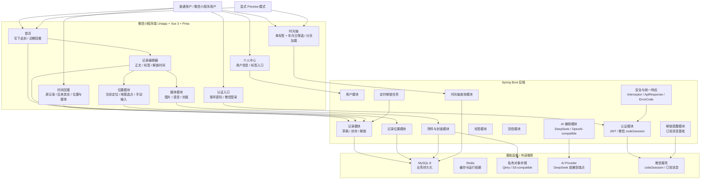
## 3. 核心用例图

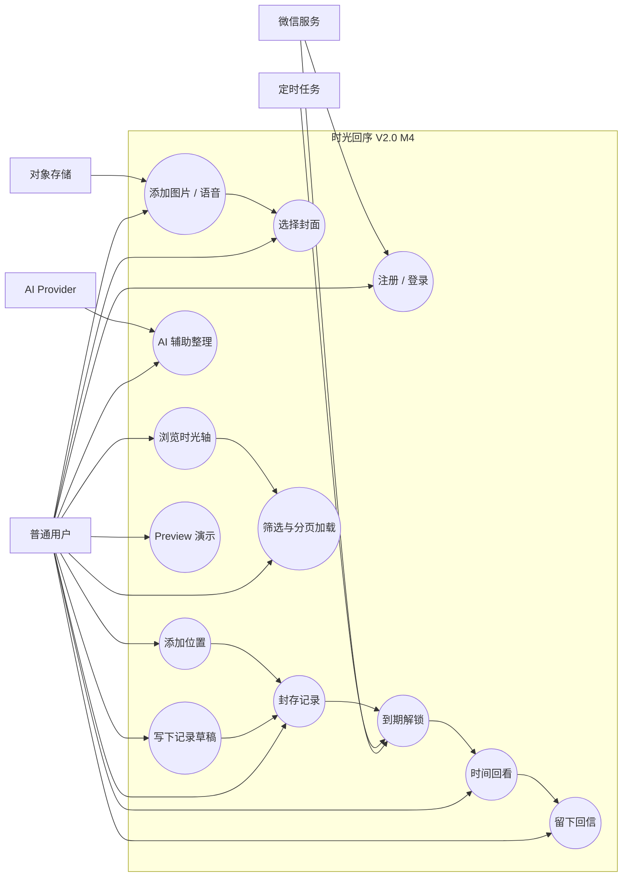

## 4. 包图 / 文件模块结构

### 4.1 后端包结构

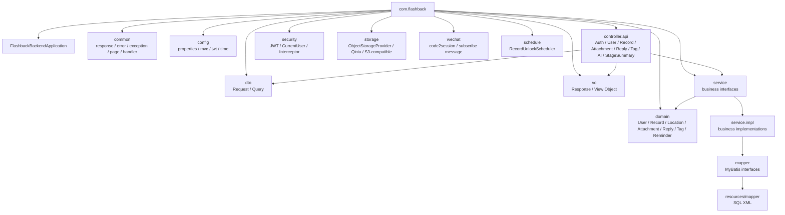

### 4.2 前端文件模块结构

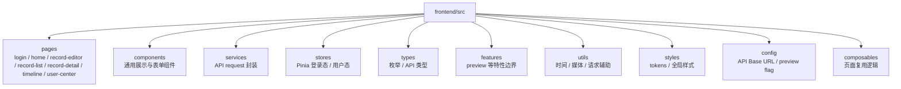

## 5. 核心类关系图

### 5.1 后端分层类关系

```mermaid
classDiagram
    class AuthController
    class UserController
    class RecordController
    class RecordAttachmentController
    class ReplyController
    class TagController
    class AiController
    class StageSummaryController

    class UserService
    class RecordService
    class RecordAttachmentService
    class ReplyService
    class TagService
    class AiService
    class StageSummaryService

    class UserServiceImpl
    class RecordServiceImpl
    class RecordAttachmentServiceImpl
    class ReplyServiceImpl
    class TagServiceImpl
    class AiServiceImpl
    class StageSummaryServiceImpl

    class UserMapper
    class RecordMapper
    class RecordLocationMapper
    class RecordAttachmentMapper
    class RecordTagMapper
    class ReplyMapper
    class TagMapper
    class RecordReminderMapper
    class UnlockNoticeLogMapper

    AuthController --> UserService
    UserController --> UserService
    RecordController --> RecordService
    RecordAttachmentController --> RecordAttachmentService
    ReplyController --> ReplyService
    TagController --> TagService
    AiController --> AiService
    StageSummaryController --> StageSummaryService

    UserService <|.. UserServiceImpl
    RecordService <|.. RecordServiceImpl
    RecordAttachmentService <|.. RecordAttachmentServiceImpl
    ReplyService <|.. ReplyServiceImpl
    TagService <|.. TagServiceImpl
    AiService <|.. AiServiceImpl
    StageSummaryService <|.. StageSummaryServiceImpl

    UserServiceImpl --> UserMapper
    RecordServiceImpl --> RecordMapper
    RecordServiceImpl --> RecordLocationMapper
    RecordServiceImpl --> RecordAttachmentMapper
    RecordServiceImpl --> RecordTagMapper
    RecordServiceImpl --> RecordReminderMapper
    RecordServiceImpl --> UnlockNoticeLogMapper
    RecordAttachmentServiceImpl --> RecordAttachmentMapper
    RecordAttachmentServiceImpl --> RecordMapper
    ReplyServiceImpl --> ReplyMapper
    TagServiceImpl --> TagMapper
```

### 5.2 对象存储适配类关系

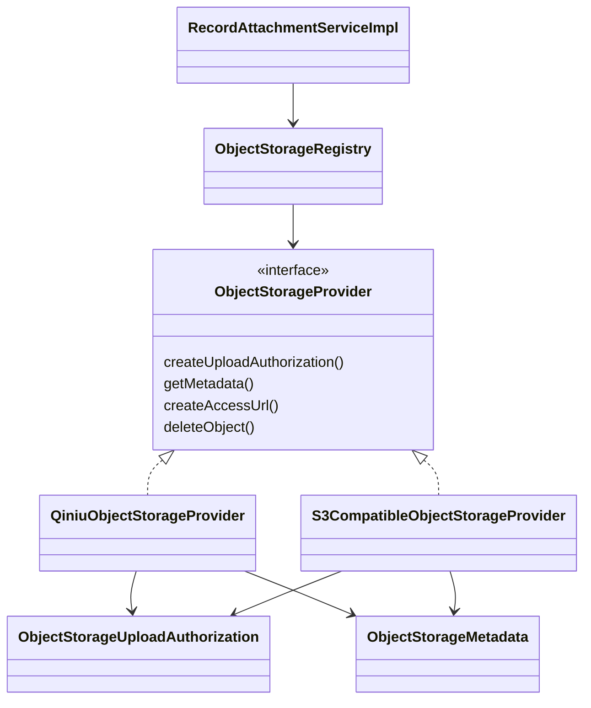

### 5.3 核心数据类关系

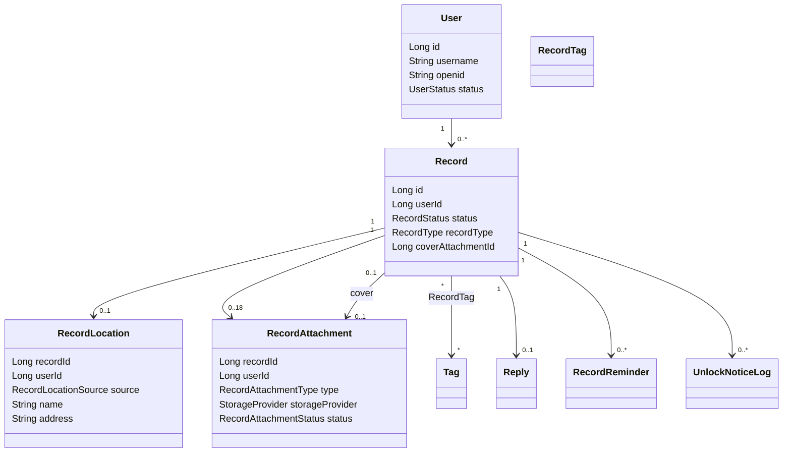

## 6. 关键业务流程图

### 6.1 记录生命周期

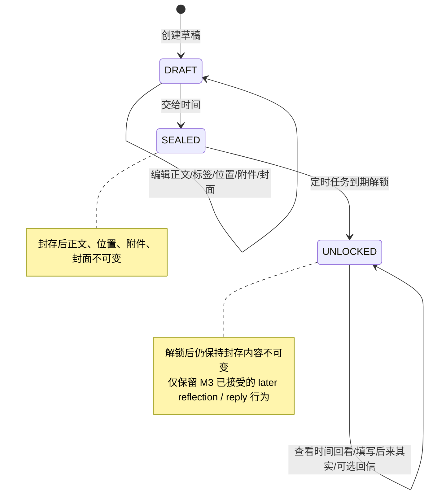

### 6.2 创建草稿并封存

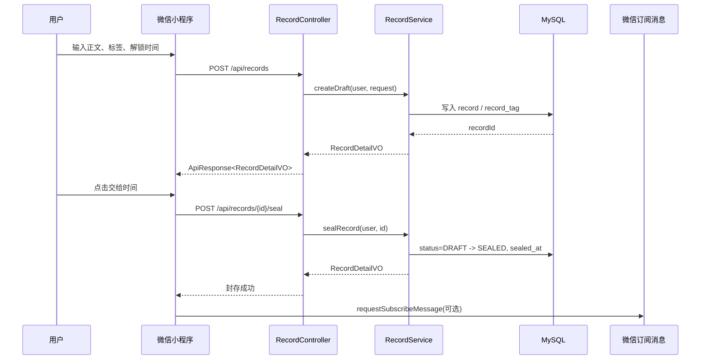

### 6.3 位置保存流程

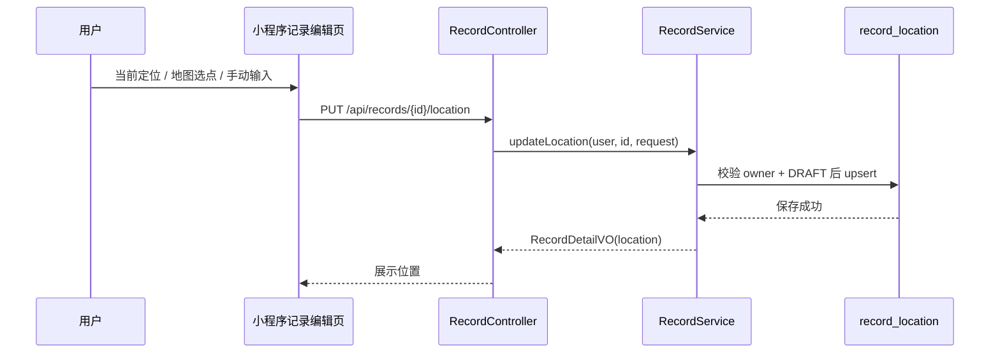

### 6.4 附件上传与封面选择流程

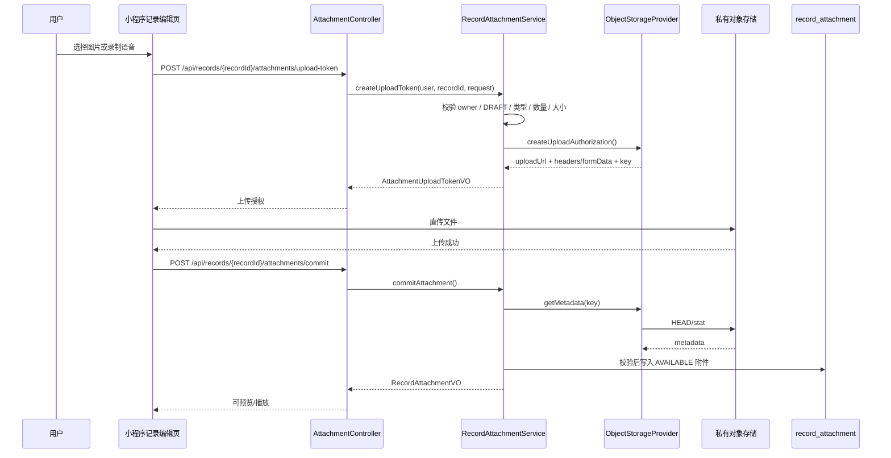

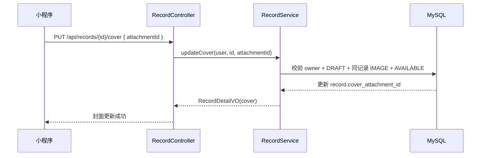

### 6.5 AI 辅助流程

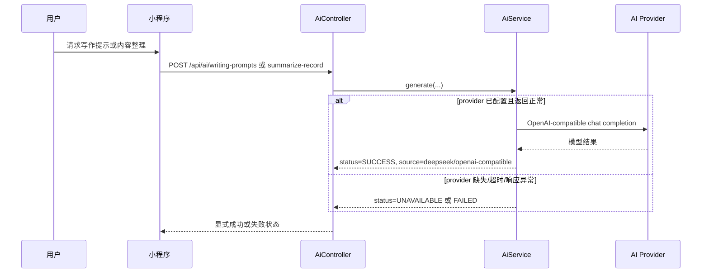

### 6.6 时光轴筛选与分页

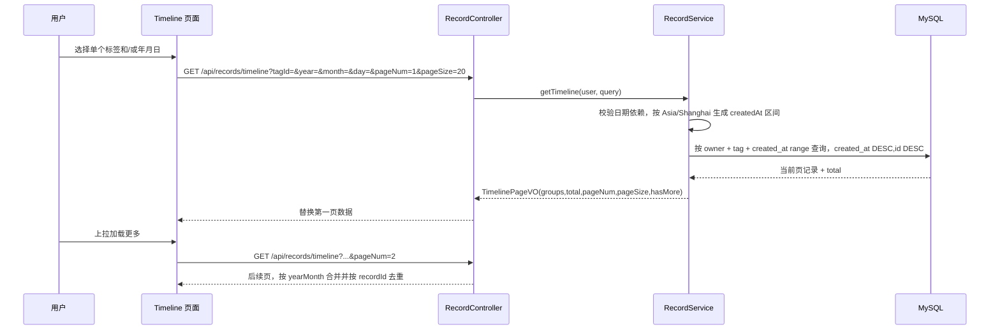

## 7. 逻辑部署图

> M4 不是生产部署或发布加固阶段。下图表达本地/演示/准生产能力的逻辑部署关系，不代表已完成线上生产架构。

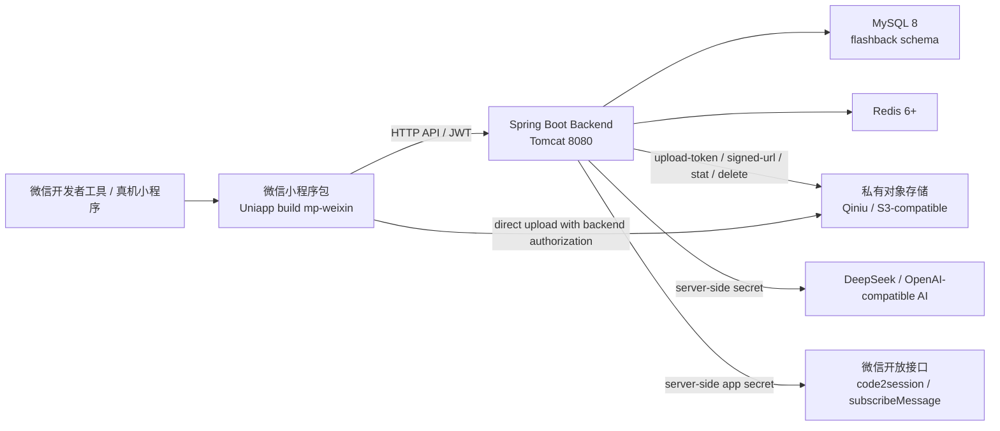
